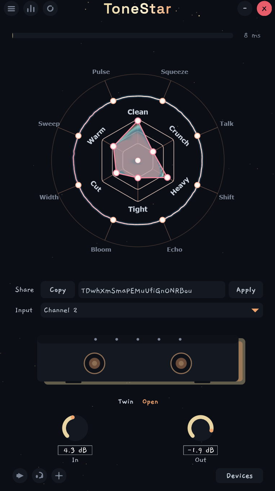
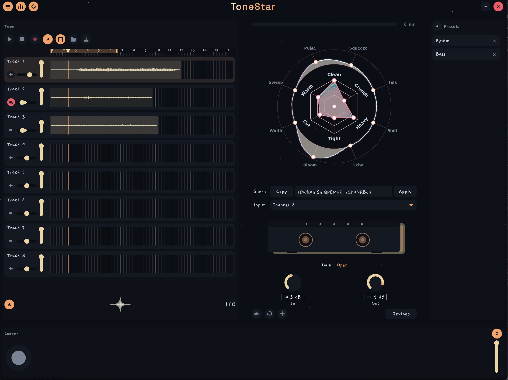
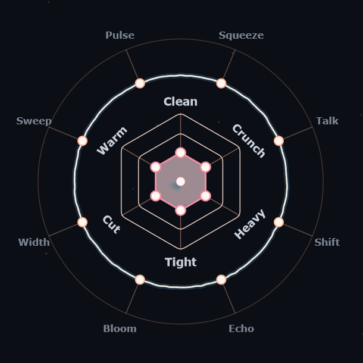
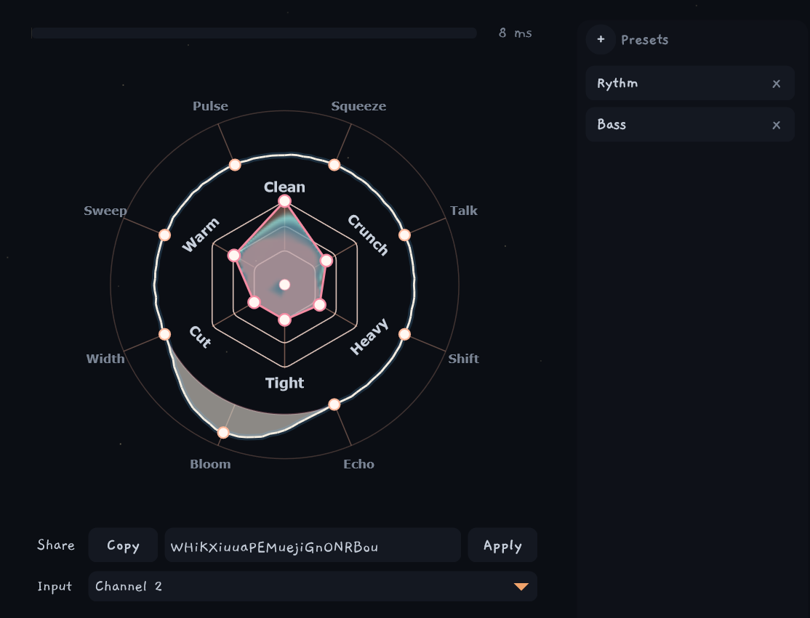
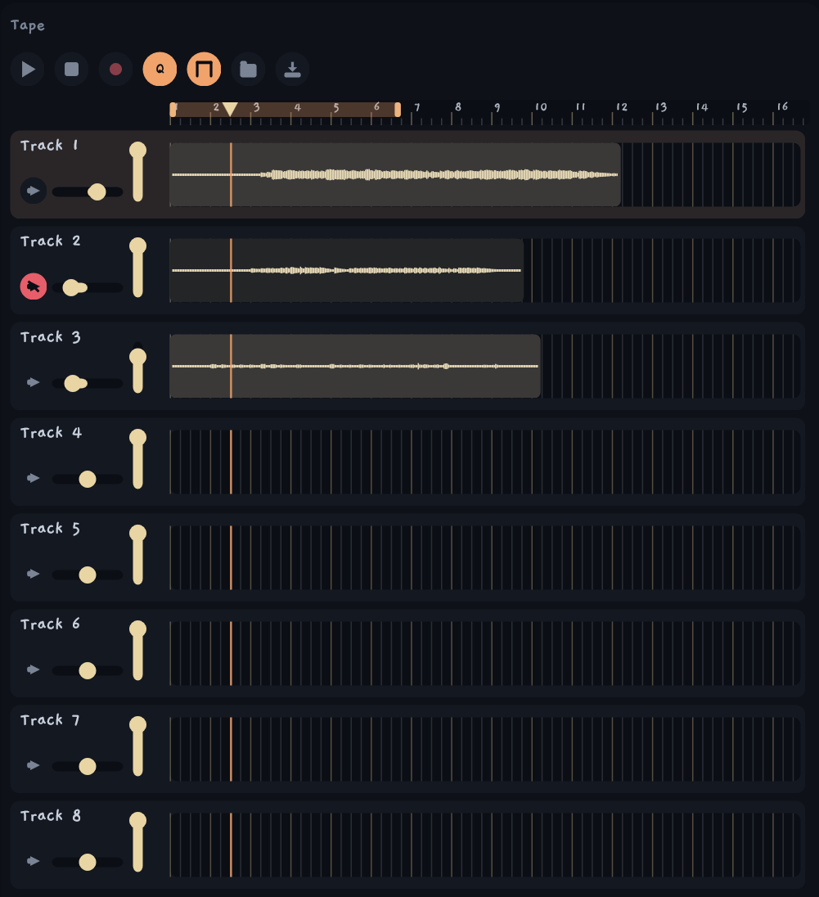
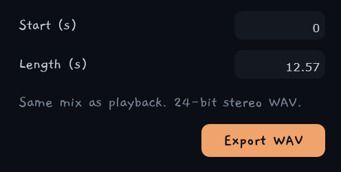
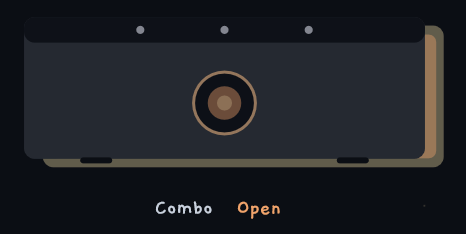
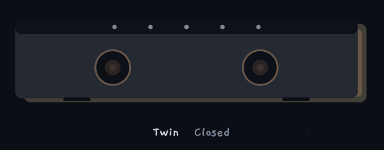
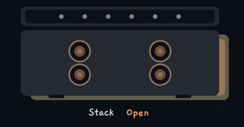
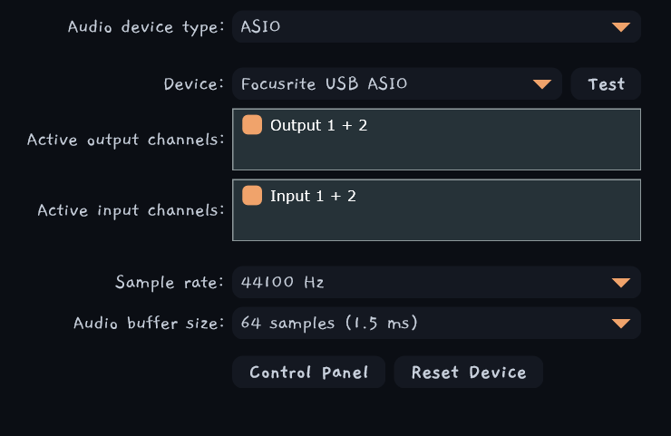

# ToneStar

<p align="center">
  
</p>

<p align="center">
  <strong>A Windows box for guitar and vocals. Starts from the sound you want, not a row of knobs.</strong>
</p>

Guitar is a six-point star, an eight-handle FX ring, and a cab. Vocals is a five-point star, a six-handle ring, and a key. Share a tone with a code. Record eight tape lanes. Loop a phrase. Export a 24-bit WAV.

No faceplate. No plugin host. Just the input, in.

---

## The whole rig

<p align="center">
  
</p>

Open the drawers and the window grows around the star.

- **Tape** on the left: eight-lane practice recorder, metronome, and tuner.
- **Star** in the middle: amp or vocal strip, FX, cab (guitar only), share code.
- **Presets** on the right: saved tones. Guitar and vocals keep separate lists. Double-click one.
- **Looper** underneath: a phrase pedal after the tape.

**GUITAR | VOCALS** sits on the title bar, after the drawer buttons. One click. The star and the ring swap, the cab hides in vocals, and the preset list changes. Tape and the looper stay put. Mid-session flips keep rolling.

The **BPM metronome** and the **tuner** live on the tape strip. Turn the click on, set the tempo, and tape and looper can lock to it. Flip the tuner on to see the dry input against A440.

**Binaural** is guitar-only, for headphones. Flip it on and the cab sits in front of you, a bit down, instead of sitting in the middle of your head.

**Two loopers.** Simple is one phrase, like a Ditto. Advanced is two phrases, like an RC-500. Right-click the Looper title to switch.

Every click and gesture is in [docs/controls.md](docs/controls.md). Vocals design notes are in [docs/vocals.md](docs/vocals.md).

---

## Starmap

<p align="center">
  
</p>

Center is already a playable amp. Each vertex is a job. Pull one, or stack a few. They rewrite one amp together.

| Pull | You want |
| --- | --- |
| **Clean** | Hear the guitar. Headroom, pick, sparkle. |
| **Crunch** | Edge of breakup. Mids, sag, classic grind. |
| **Heavy** | Chug. Extra stages, compression, palm-mute clank. |
| **Tight** | Faster, less bloom. High-pass, less hang. |
| **Cut** | Sit in the band. Forward 0.5–3 kHz. |
| **Warm** | Darker and smoother. Softer clip, a bit of body. |

Shift-drag for fine moves. Double-click a spoke to zero it.

**Pairs that work:** Heavy + Tight = modern rhythm. Clean + Warm = jazz / bedroom. Crunch + Cut = it cuts a mix.

---

## FX ring

The eight handles around the star are how much of that land. All start at zero. The live line on the ring is the mix. It follows the handles and moves with the guitar.

**Before the amp** (listens to the clean string):

- **Squeeze**: glue to sustain to squash
- **Talk**: mild attack quack to a full vocal sweep
- **Shift**: fat low octave to 12-string to synth stack

**After the amp** (sits on the finished tone):

- **Echo**: slapback to dotted rhythm to shoegaze wash
- **Bloom**: kiss of spring to plate to cloud
- **Width**: slow thicken to a deeper chorus
- **Sweep**: phaser to flange
- **Pulse**: soft throb to a hard trem chop

Right-click the **Bloom** label for **Shimmer**. Same handle, octave-up on the tail.

---

## Vocals

Click **VOCALS** on the title bar. The cab and binaural go away. The star becomes a channel strip. Center is already a usable voice: high-pass, a light gate, a hidden de-ess, a gentle leveler, a bit of presence.

Five pulls. Not six. Center *is* the clear voice, so there is no Clear spoke.

| Pull | You want |
| --- | --- |
| **Grit** | Bark. Hold against guitars. Saturation and a mid push. |
| **Crush** | In your face. Even, loud, modern. Stacked compression. |
| **Tight** | Close and dry. Higher high-pass, less low-mid, hungrier gate. |
| **Cut** | Sit in the band. Forward 2–5 kHz, less mud. |
| **Warm** | Darker and smoother. Chest, less air, softer clip. |

**Pairs that work:** Crush + Tight = dry pop / rap. Grit + Cut = rock. Grit + Tight = scream. Warm + a little Crush = soul / jazz. Crush + Cut = radio pop.

### Vocal FX

Six handles. All start at zero.

- **Tune**: polish to noticeable to hard. Needs a key.
- **Double**: fatten to ADT to a wide stack.
- **Echo**: slap to 1/8 to a dotted throw. Ducked. Follows tape BPM.
- **Bloom**: room to plate to hall. Ducked. No shimmer.
- **Stack**: a 3rd below, then 3rd + 5th, then a small choir. Needs a key.
- **Phone**: dull lo-fi to radio to telephone.

### Key

Top right, vocals only. Shows `C`, `Cm`, `C#`, `Eb`, and so on. Scroll or hold-and-drag to walk keys. Small arrows next to it do the same. Click the circle to flip major / minor. Tune and Stack read this. Hide it in guitar.

### Dry tape

A vocal lane does not print the wet chain. The WAV is the mic after the channel pick, before In, the star, and FX. The vocal slug (star, ring, key) is stored on that lane. Play and export run that file through **that lane's** slug. Change Crush on the selected vocal track and the take updates. No re-sing.

Guitar lanes stay printed after amp and cab.

Through-chain clips show a small **V**. Selecting a vocal track does not flip GUITAR to VOCALS. The title toggle is the only mode switch. If you are already in VOCALS, selecting a vocal lane loads that slug. Live edits write back onto the selected through-chain lane.

Vocal lanes keep running their stored slugs in guitar mode, so you can play guitar on top of processed vocals. Two vocal takes can disagree (verse Crush, chorus Warm). Each plays through its own slug.

In and Out sit on the vocal chain, so balance is part of what you can change after the take.

---

## Presets

<p align="center">
  
</p>

Share a preset with a code. Copy the slug, send it, paste it, hit **Apply**.

Guitar codes carry the starmap, FX, shimmer, binaural, and cab. Vocal codes carry the starmap, FX, and key. They do not mix. The drawer shows the list for the mode you are in.

Open the drawer, hit **+** to save the current tone, **double-click** to load one. Right-click to rename. X to delete. Keep as many as you want.

In, Out, mute, and your audio device stay as they are. The code is the sound, not the room.

---

## Tape

<p align="center">
  
</p>

Eight-lane linear practice tape. Click a track to arm it. Hit record. Play it back.

Guitar records the finished amp after Out. Vocals record the dry mic and play it through that lane's slug.

**Q** waits for the next beat to start and closes on a beat. Moves and trims snap to the grid.

Loop a range with the **Loop** button, then record over a track while the others play. Mute lanes you do not want in the mix. Each track has **L/R pan** and its own **volume**.

Rename a lane. Drag a clip. Crop either edge. The WAV stays whole.

Clips live in `Documents/ToneStar/tape`.

### Metronome

The click and BPM sit on the left of the tape footer. Turn the metronome on for dry clicks. Click BPM to type, hold-drag, or scroll. The sparkle pulses on each click.

### Tuner

The right half of the same footer. Toggle it on. It reads the dry input, A440, and shows the note, octave, and Hertz (`A2 110 Hz`). The bar is ±50 cents. A center line is in tune. The dot slides with you.

Off does not chase what you play. The setting sticks the next time you open the app.

---

## Export

<p align="center">
  
</p>

Export a **24-bit stereo WAV**. Same mix as playback: unmuted lanes, pans, levels. Printed guitar lanes as they were taped. Vocal lanes through their stored slugs.

Pick the range (**Start** and **Length** in seconds). One click on **Export WAV**.

---

## Looper

The looper sits after Out and Tape. Live input always passes through. Mute silences the speakers; the playhead keeps walking. **Space** is the pedal while ToneStar is focused.

**Simple** (default): one phrase, Ditto / RC-1 style.

- Tap: empty to record to play to overdub to play
- Double-tap: stop (or discard if you are still on the first take)
- Hold: undo / redo the last layer, or clear when stopped
- **Q**: free length, or wait for the beat

**Advanced**: right-click the Looper title. Two phrases, like an RC-500. Each has rec/play, stop, and level. The first closed phrase is master. The second locks to its length and waits for the downbeat.

The looper is wet, after tape. It does not change when you flip to VOCALS.

---

## Cabs

Guitar only. Always on under the star. Hidden in vocals. Three sizes. Open or closed back.

<p align="center">
  
  &nbsp;&nbsp;
  
  &nbsp;&nbsp;
  
</p>

<p align="center">
  <strong>Combo</strong> &nbsp;·&nbsp; <strong>Twin</strong> &nbsp;·&nbsp; <strong>Stack</strong>
</p>

Wheel or click **Size** to step Combo, Twin, Stack. Right-click **Back** for **Open** or **Closed**. Open air or a sealed box.

**Binaural** uses a SADIE II HRTF so headphones hear that cab in front of you, not in the middle of your head.

---

## In, Out, devices

<p align="center">
  
</p>

**In** is how hard you hit the amp or the vocal strip. **Out** is how loud the live path is. Printed guitar lanes mix in after Out. Vocal through-lanes go through Out, because the take is dry. **Mute** silences the speakers without stopping tape or the looper.

**Devices** picks the interface. Use the same device for input and output. On Windows that is ASIO duplex. Turn Direct Monitor **off** or you will hear double. On Mac it is Core Audio.

---

## If something breaks

Turn **Debug** on, play a bit, then click the folder button next to it. Send that whole ToneStar folder. Do not pick files out of it.

- Windows: `%APPDATA%\ToneStar`
- Mac: `~/Library/Application Support/ToneStar`
- Linux: `~/.config/ToneStar`

---

## Mac

Apple Silicon only, unsigned. GitHub, **Actions**, **Mac**, **Run workflow**. Download `ToneStar-mac-arm64.zip`, unzip, right-click **ToneStar**, **Open**.

Not notarized. Intel Macs are not built.

---

## Build

Windows 10/11, Visual Studio 2022 with the CMake workload.

```bat
build.bat
```

Release exe: `build/ToneStar_artefacts/Release/ToneStar.exe`. Close the app first (the exe locks).

```bat
package.bat
```

Same build, then `dist/ToneStar.zip`. No install.

```
cmake -S . -B build
cmake --build build --config Release --target ToneStar
```

On a Mac:

```bash
bash scripts/build-mac.sh
```

That writes `dist/ToneStar-mac-arm64.zip`. JUCE 8.0.15 is fetched at configure time.

## Licence

Copyright 2026 ToneStar authors. GNU AGPLv3. See [`LICENSE`](LICENSE) and [`licenses/THIRD_PARTY.md`](licenses/THIRD_PARTY.md) for JUCE, Steinberg ASIO, SIL OFL fonts, SADIE Apache 2.0 HRTF, and the CC0 cab IR. Official Windows builds may be sold as convenience; anyone can compile the same source.
